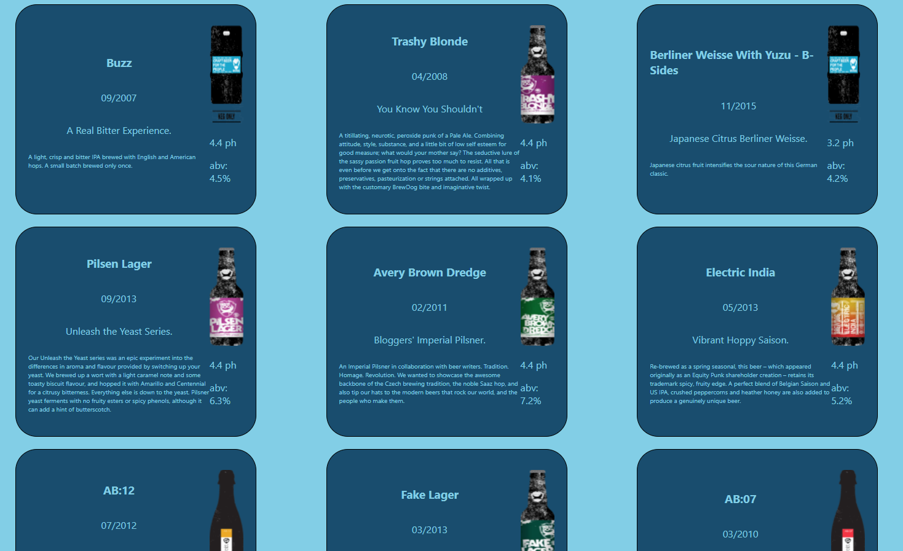

# Punk API 

This application allows you to search for and filter for your favorite Brewdog beers. It uses the [Brewdog Punk API](https://punkapi.com/).

This was an exercise in understanding component hierarchy in React and passing down state and functions as props.

## Instructions
On input the filters filter by the users input and the checkbox filters add set filters

### Languages Used
* React
* HTML 5
* CSS 3/SCSS
* Javascript ES6
